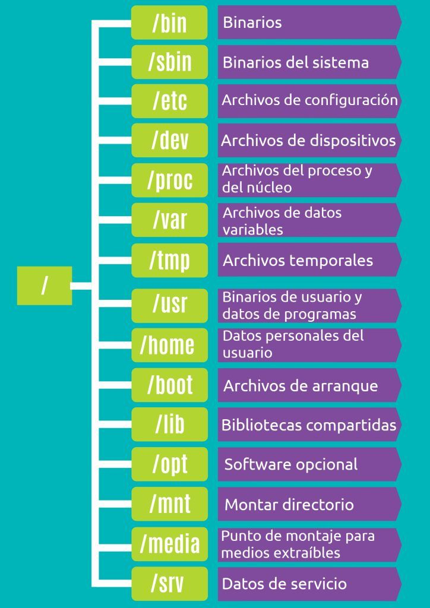

# Manual Linux - Ubuntu 

`sudo -i` : acceder a consola superusuario

`free -mh` : Visualizar memoria

`top`: ver procesos

`htop`: visualizacón más gráfica de los procesos


## Usuarios

1. `root`
2. usuarios normales
3. usuarios de sistema

`home`: directorio del usuario

Cada usuario pertenece almenos a un grupo


### Root
- `/root` : su directorio de trabajo
- Privilegios totales de sistema
- No se recomienda trabajar habitualmente con él
- Su prompt comienza con `#`

```bash
siok@PYT [21:20:04] [~/ManualLinux] [main]
-> % sudo -i
root@PYT:~# 
root@PYT:~# exit
cerrar sesión
```

### Usuario Normal

- Los crea el root
- `/home`: su directorio

### Usuarios especiales

- Para ejecutar diversos procesos en el sistema. Ejm:
`bin`
- No tienen shell, usuarios de sesión `no login`

## Ficheros

Forma de guardar los datos. Usa una estructura tipo árbol

